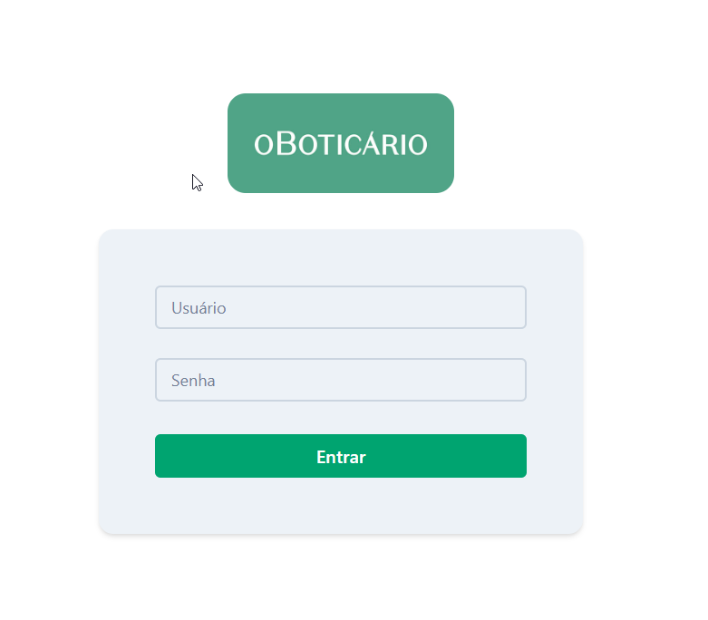
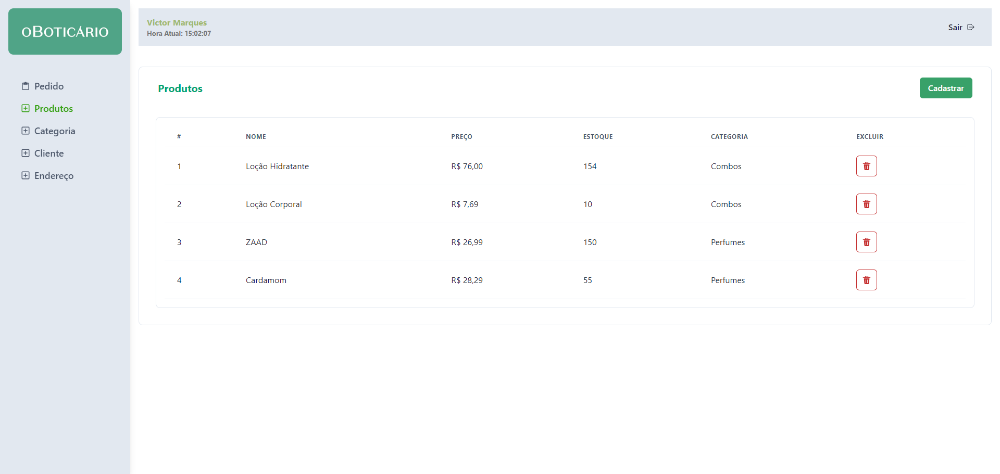
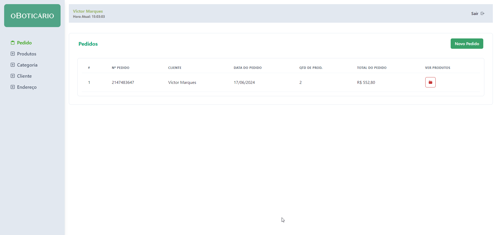
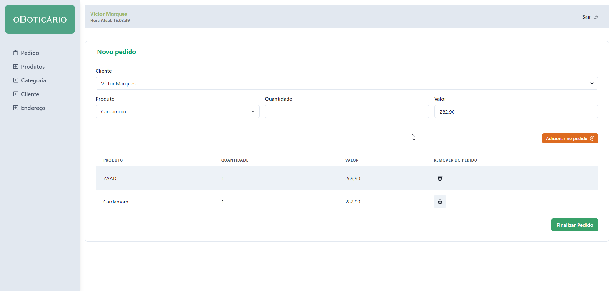

## Teste Técnico para [O Boticario](https://www.grupoboticario.com.br/). 

Este repositório contém a implementação de um teste técnico. O projeto consiste em uma aplicação completa com backend em Node.js e frontend em React. Seguem as instruções para configuração e execução do projeto.

-  Back-end
[Clique aqui](https://github.com/vctormarques/o-boticario-test/tree/master/back-end) para rodar o back-end.

- Front-end
[Clique aqui](https://github.com/vctormarques/o-boticario-test/tree/master/front-end) para rodar o front-end.

## Abaixo alguns prints do sistema
* Login

* Produtos

* Pedidos

* Novo Pedido

